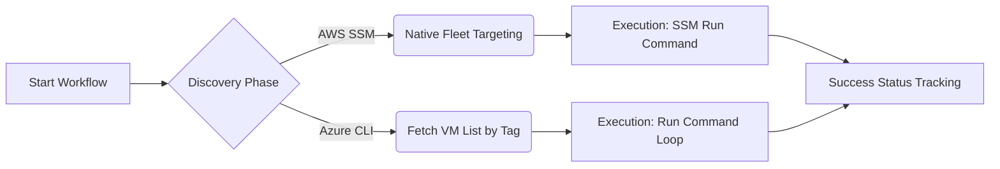

# 🏗️ Universal Multi-Cloud Patching Command Center

This project implements a professional, high-uptime automation suite for cross-platform system maintenance. Using **GitHub Actions**, **Azure OIDC**, and **AWS OIDC (Mumbai)**, it provides a centralized "Remote Control" for patching your global fleet of Ubuntu and Windows instances.

---

## 🔍 The "Discovery" Phase (The Query)

In a professional patching pipeline, you don't start by patching; you start by **Searching**. Instead of hardcoding VM names, this project uses a dynamic discovery model:

> "Find all VMs where Tag:OS == Ubuntu"

### 🛡️ AWS Theory
AWS handles this natively using the **Systems Manager (SSM) API**. The workflow sends a "Target" filter to the SSM API. AWS scans its internal database and executes the command on every matching instance **simultaneously**.

### 🛡️ Azure Theory
Azure requires a explicit **"List" step**. The workflow runs a command to fetch a JSON list of VM names and Resource Groups that match the tag, stores them in a variable, and then moves to the execution phase to iterate through each target.



---

## 🌟 The "Matrix-style" Selector

The project's centerpiece is a **Single-Cloud Patching Selector** that allows you to target specific environments or your entire global fleet in a single run.

| Feature | Target | Selection Logic |
| :--- | :--- | :--- |
| **Cloud Provider** | AWS, Azure, BOTH | Dynamic OIDC Login & Discovery |
| **OS Type** | Ubuntu, Windows, BOTH | OS-Specific Scripts & Tag Filtering |

---

## 📂 Repository Structure

The repository is the **Single Source of Truth** for your patching fleet:
```text
.github/workflows/
  ├── patching-selector.yml  # Matrix Selector (Dropdown Tool)
  ├── ubuntu-patching.yml    # Dynamic Ubuntu Fleet Patching
  └── windows-patching.yml   # Dynamic Windows Fleet Patching

scripts/
  ├── ubuntu/
  │   └── patch.sh           # Core logic for Linux (apt, kernel headers)
  └── windows/
      └── patch.ps1          # Core logic for Windows (PSUpdate, Choco)
```

---

## 🛠️ Getting Started

For detailed steps on setting up OIDC, tagging your infrastructure, and triggering your first run, please refer to:

👉 **[HOW_TO_RUN.md](./HOW_TO_RUN.md)**

---

## ✅ Fleet Status Reporting (Validation)

Run these validation commands from your terminal to monitor your global patching status:

### Azure Global Search (All VM Patch Status)
```bash
az vm list --query "[?tags.OS=='Ubuntu'].{Name:name, RG:resourceGroup}" -o table
```

### AWS SSM Status (Recent Executions)
```bash
aws ssm list-command-invocations --details --query "CommandInvocations[*].{Instance:InstanceId,Status:Status,Comment:Comment}" --output table
```

---

## 🔒 Security Policy

This project strictly follows a **Secretless Architecture** using OpenID Connect (OIDC). No long-lived access keys or credentials are stored within the repository.
